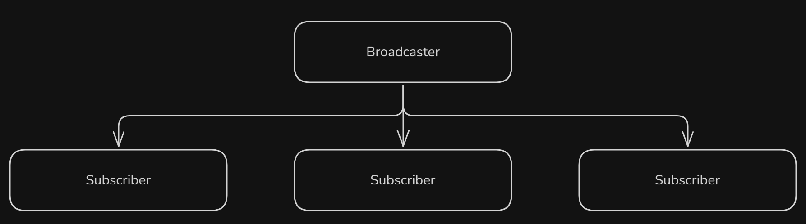
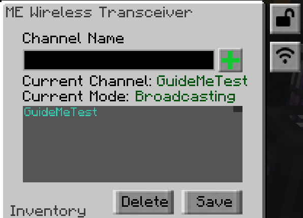
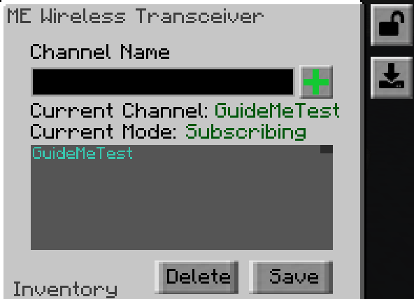

---
navigation:
    title: ME Wireless Transceiver
    parent: aeadditions.md
item_ids:
  - ae2additions:me_wireless_transceiver
---
# ME Wireless Transceiver

## What can this do?

This block allows you to extend your network wirelessly over any distance, but not over dimensions. They can carry 32 channels in total. The further you place transceivers apart, the higher their power demand is.

What sets this apart from the quantum bridge is that you can bind transceivers to a named channel. Once a transceiver is bound to a channel as a broadcaster, you can now subscribe to that channel on any transceiver you want, in the same dimension.

If you want to transmit over dimensions, then the quantum bridge should be used.

# Basic Setup

<GameScene zoom="4" interactive={true}>
    <ImportStructure src="assets/wirelesstransceiver/basic_setup.snbt" />
    <BoxAnnotation color="#dddddd" min="6 0 7" max="7 1 6">
        This transceiver is set up as a broadcaster:

        
    </BoxAnnotation>

    <BoxAnnotation color="#dddddd" min="10 0 7" max="11 1 6">
        This transceiver is set up as a subscriber:

        
    </BoxAnnotation>
    <BoxAnnotation color="#dddddd" min="10.1 1.1 6.1" max="10.9 1.9 6">
        This terminal is now connected to the controller, as long as power is supplied & max channels aren't taken up.
    </BoxAnnotation>
</GameScene>

# Recipe
<RecipeFor id="me_wireless_transceiver"/>