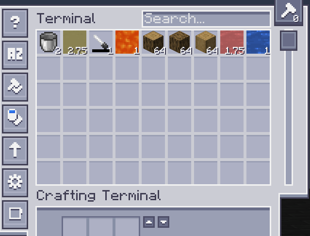
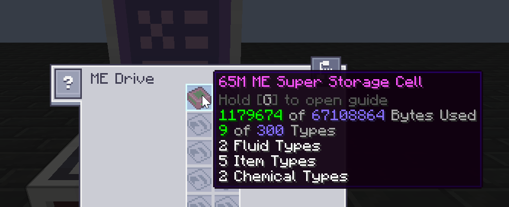

---
navigation:
    title: Super Storage Cell
    parent: aeadditions.md
item_ids:
  - ae2additions:super_cell_65m
  - ae2additions:super_cell_16m
  - ae2additions:super_cell_4096k
  - ae2additions:super_cell_1024k
  - ae2additions:super_cell_256k
  - ae2additions:super_cell_64k
  - ae2additions:super_cell_16k
  - ae2additions:super_cell_4k
  - ae2additions:super_cell_1k
  - ae2additions:super_cell_component_65m
  - ae2additions:super_cell_component_16m
  - ae2additions:super_cell_component_4096k
  - ae2additions:super_cell_component_1024k
  - ae2additions:super_cell_component_256k
  - ae2additions:super_cell_component_64k
  - ae2additions:super_cell_component_16k
  - ae2additions:super_cell_component_4k
  - ae2additions:super_cell_component_1k
---
# Super Storage Cell

The Super Storage Cell is a very powerful cell, which allows you to store fluids, items, chemicals, etc in the same cell. You no longer need a cell for fluids, a cell for items and so on.

<Row>

</Row>

# Recipes
<Row>
  <RecipesFor id="ae2additions:super_cell_component_65m"/>
  <RecipesFor id="ae2additions:super_cell_65m"/>
</Row>

<Row>
  <RecipesFor id="ae2additions:super_cell_component_16m"/>
  <RecipesFor id="ae2additions:super_cell_16m"/>
</Row>

<Row>
  <RecipesFor id="ae2additions:super_cell_component_4096k"/>
  <RecipesFor id="ae2additions:super_cell_4096k"/>
</Row>

<Row>
  <RecipesFor id="ae2additions:super_cell_component_1024k"/>
  <RecipesFor id="ae2additions:super_cell_1024k"/>
</Row>

<Row>
  <RecipesFor id="ae2additions:super_cell_component_256k"/>
  <RecipesFor id="ae2additions:super_cell_256k"/>
</Row>

<Row>
  <RecipesFor id="ae2additions:super_cell_component_64k"/>
  <RecipesFor id="ae2additions:super_cell_64k"/>
</Row>

<Row>
  <RecipesFor id="ae2additions:super_cell_component_16k"/>
  <RecipesFor id="ae2additions:super_cell_16k"/>
</Row>

<Row>
  <RecipesFor id="ae2additions:super_cell_component_4k"/>
  <RecipesFor id="ae2additions:super_cell_4k"/>
</Row>

<Row>
  <RecipesFor id="ae2additions:super_cell_component_1k"/>
  <RecipesFor id="ae2additions:super_cell_1k"/>
</Row>

